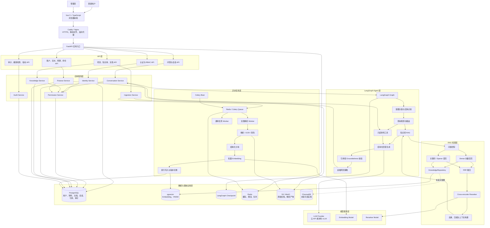
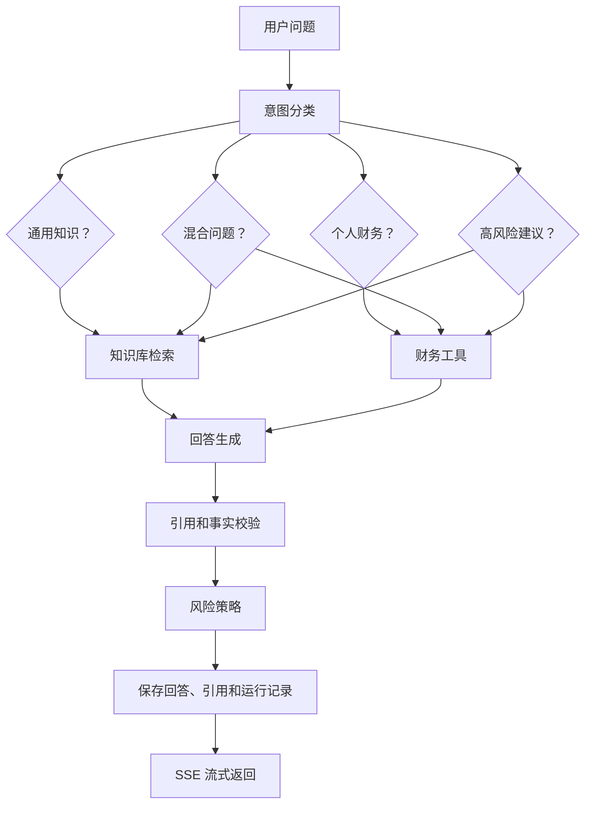
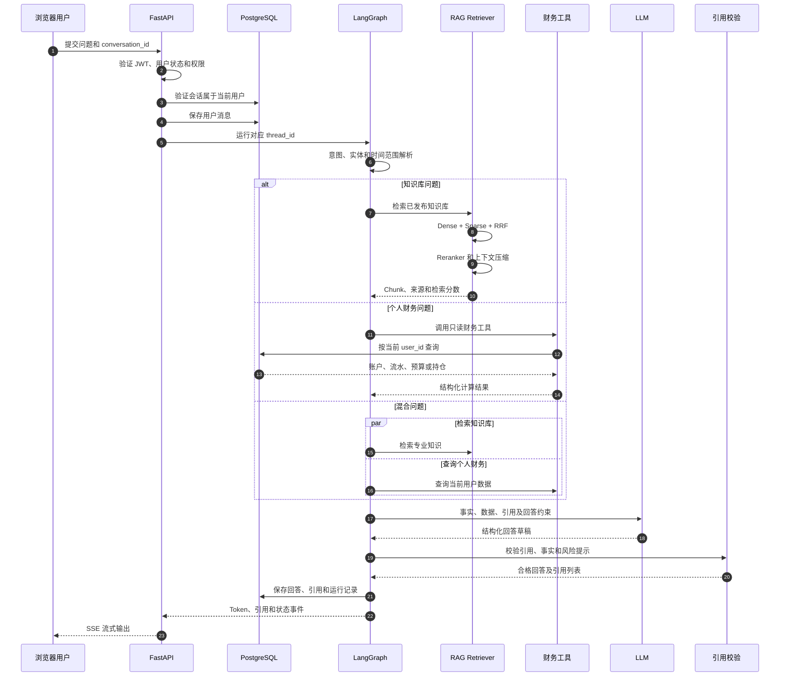
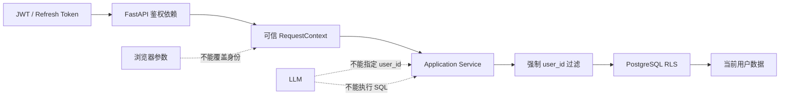

# Aurum Agent 总体架构设计

> 文档状态：总体架构设计，已按阶段一、二实现持续校准  
> 项目目录：`E:\agent_aurum`  
> 初步方案：[aurum-agent-initial-design.md](./aurum-agent-initial-design.md)  
> 部署方案：[aurum-agent-deployment-guide.md](./aurum-agent-deployment-guide.md)  
> 当前交接：[aurum-agent-current-handoff.md](./aurum-agent-current-handoff.md)  
> 编写日期：2026-07-23  
> 最后更新：2026-07-24

## 1. 文档目标

本文档用于描述 Aurum Agent 的整体技术架构、主要组件、数据流、权限边界和扩展方式。

当前阶段只聚焦 `agent_aurum` 独立项目，不依赖其他业务系统。项目内部形成完整闭环，包括：

- 浏览器前端；
- 用户注册、登录和鉴权；
- 管理员和普通用户权限；
- 项目及知识库管理；
- 文档解析和向量索引；
- LangGraph Agent；
- RAG 问答和引用；
- 多用户、多会话；
- 个人账户、流水、预算和持仓；
- 异步任务；
- 监控、审计、备份和部署。

## 2. 架构目标

### 2.1 功能目标

- 管理员可以通过浏览器管理项目、知识库和文档；
- 普通用户只能使用已发布知识库进行问答；
- 回答能够显示真实引用片段；
- 用户拥有独立会话和历史消息；
- 用户能够查询自己的账户、收支、存款和投资数据；
- 知识库信息与个人财务数据可以联合生成回答；
- Agent V1 只执行读取操作；
- 未来写操作必须经过用户确认。

### 2.2 非功能目标

- 多用户数据隔离；
- 高可追溯性；
- 财务数值准确；
- 可观测；
- 可恢复；
- 可水平扩展；
- 模型和向量库可替换；
- 文档处理可异步扩容；
- 生产环境密钥和隐私数据安全。

## 3. 核心架构原则

### 3.1 独立闭环

当前项目自行负责用户、权限、财务数据、知识库、会话和 Agent，不依赖外部身份或财务系统。

### 3.2 分层设计

```text
API / Router
    ↓
Application Service
    ↓
Domain Service / LangGraph / RAG
    ↓
Repository / Provider
    ↓
PostgreSQL / Redis / Object Storage / Model API
```

API 层只处理请求协议、输入校验和响应序列化。业务规则位于 Application Service 和 Domain Service。

### 3.3 模型不能直接操作数据库

LLM 只能调用经过注册的业务工具。

禁止：

- 模型执行任意 SQL；
- 模型指定任意用户 ID；
- 模型直接写入财务表；
- 模型绕过权限校验；
- 模型自行生成未经验证的引用 ID。

### 3.4 结构化数据与非结构化知识分离

- 财务知识文档使用 RAG；
- 账户、流水、预算和持仓使用确定性业务工具；
- 混合问题同时调用 RAG 和财务工具；
- 金额、收益和预算等数值由服务端计算，不由模型猜测。

### 3.5 主数据与检索索引分离

PostgreSQL 中的文档、版本、Chunk 和权限记录是主数据。

向量库是可重建的检索索引。即使未来从 pgvector 切换到 ChromaDB，也不能将向量库作为文档和权限的唯一真实数据源。

## 4. 总体架构图



## 5. 分层职责

| 层级 | 主要职责 |
|---|---|
| Vue 前端 | 登录、问答、引用展示、会话、财务页面、管理员页面 |
| Caddy/Nginx | HTTPS、静态资源、反向代理、SSE 转发 |
| FastAPI | HTTP API、鉴权依赖、输入校验、请求上下文 |
| Application Service | 用户、知识库、财务、会话和任务业务规则 |
| LangGraph | 意图路由、工具调用、RAG、生成、引用和风险校验 |
| Repository | 数据持久化抽象 |
| Provider | LLM、Embedding、行情、对象存储等外部能力抽象 |
| PostgreSQL | 关系数据、主数据和引用关系 |
| pgvector | 文档 Embedding 和向量索引 |
| Redis/Celery | 缓存、限流、队列和异步任务 |
| S3/MinIO | 原始文件和解析产物 |
| 模型服务 | LLM、Embedding 和 Reranker |

## 6. 浏览器前端架构

### 6.1 普通用户页面

- 注册；
- 登录；
- 修改密码；
- 个人资料；
- 会话列表；
- 新建会话；
- 问答；
- 引用查看；
- 账户和存款；
- 收支流水；
- 预算；
- 投资持仓；
- 财务摘要。

### 6.2 管理员页面

- 项目管理；
- 知识库管理；
- 文档上传和预览；
- 文档版本；
- 解析和索引任务；
- Chunk 预览；
- 检索测试；
- 模型及提示词配置；
- 用户状态管理；
- 审计日志。

### 6.3 前端权限

前端路由守卫用于改善用户体验，但不能作为最终授权依据。

所有管理 API 必须在 FastAPI 后端重新验证管理员角色。

## 7. FastAPI 架构

### 7.1 API 模块

建议的 API 模块：

```text
/api/v1/auth
/api/v1/users
/api/v1/conversations
/api/v1/chat
/api/v1/accounts
/api/v1/transactions
/api/v1/budgets
/api/v1/holdings
/api/v1/projects
/api/v1/knowledge-bases
/api/v1/documents
/api/v1/ingestion-jobs
/api/v1/admin
/health/live
/health/ready
/metrics
```

### 7.2 请求上下文

鉴权成功后创建服务端请求上下文：

```python
class RequestContext:
    user_id: UUID
    role: str
    request_id: str
    trace_id: str
```

业务接口和 Agent 工具从 `RequestContext` 获取用户身份。

浏览器请求体和模型工具参数中不得接受任意 `user_id`。

### 7.3 错误响应

后端使用统一错误结构：

```json
{
  "code": "KNOWLEDGE_BASE_NOT_FOUND",
  "message": "知识库不存在或无权访问",
  "request_id": "request-uuid"
}
```

生产环境不向浏览器返回内部堆栈。

## 8. LangGraph Agent 架构

### 8.1 状态

Agent State 初步包含：

```python
class AgentState(TypedDict):
    messages: list
    user_id: str
    conversation_id: str
    project_id: str
    intent: str
    entities: dict
    time_range: dict | None
    retrieved_chunks: list
    finance_results: list
    draft_answer: dict | None
    citations: list
    risk_level: str
    errors: list
```

真正实现时，不应在模型可修改的消息中保存可信 `user_id`。用户身份来自 LangGraph Runtime Context 或受保护配置。

### 8.2 节点

计划节点：

- `authenticate_context`
- `validate_input`
- `classify_intent`
- `extract_entities`
- `rewrite_query`
- `plan_retrieval`
- `retrieve_knowledge`
- `call_finance_tools`
- `call_market_tools`
- `rerank_context`
- `grade_context`
- `generate_answer`
- `validate_citations`
- `check_groundedness`
- `apply_financial_risk_policy`
- `persist_result`

### 8.3 路由



## 9. 核心问答时序



## 10. RAG 检索架构

### 10.1 检索流程

```text
权限和知识库范围过滤
    ↓
问题改写和关键词提取
    ↓
Dense 向量召回
    +
关键词或 Sparse 召回
    ↓
Reciprocal Rank Fusion
    ↓
Cross-encoder Reranker
    ↓
重复片段移除
    ↓
上下文 Token 控制
    ↓
相关性和充分性判断
```

### 10.2 检索结果

标准检索结果：

```python
class RetrievedChunk:
    chunk_id: UUID
    document_id: UUID
    document_version_id: UUID
    knowledge_base_id: UUID
    content: str
    title: str
    page_number: int | None
    section_path: str | None
    score: float
    retrieval_source: str
```

### 10.3 检索边界

- 只能检索当前项目绑定的知识库；
- 只能检索已发布文档版本；
- 必须应用知识库可见范围；
- 检索结果中的 Chunk ID 必须真实存在；
- 模型不能引用本次检索范围之外的 Chunk；
- 知识不足时应提示缺少资料，而不是补造事实。

## 11. 向量数据库架构

### 11.1 V1 默认实现

```text
KnowledgeRepository
        │
        ▼
PgVectorKnowledgeRepository
        │
        ▼
PostgreSQL + pgvector
```

选择 pgvector 的主要原因：

- PostgreSQL 已用于用户、财务、会话和文档主数据；
- 文档、Chunk、权限、引用和向量更容易保持一致；
- 可以使用事务、外键和 Row Level Security；
- 备份和恢复链路较简单；
- 支持 HNSW；
- 可以和 PostgreSQL 全文搜索组合。

### 11.2 未来 ChromaDB 实现

```text
KnowledgeRepository
        │
        ├── PgVectorKnowledgeRepository
        └── ChromaKnowledgeRepository
```

如果未来采用 ChromaDB：

- PostgreSQL 继续保存文档和 Chunk 主数据；
- ChromaDB 只保存可重建向量索引；
- Chroma 记录使用稳定 `chunk_id`；
- 查询前仍由 FastAPI 完成权限校验；
- Chroma 查询必须带知识库和版本过滤；
- 需要索引对账、重建和双系统备份；
- 不改变 LangGraph 工作流和引用数据结构。

### 11.3 Repository 接口

```python
class KnowledgeRepository(Protocol):
    async def upsert_chunks(self, chunks: list) -> None: ...
    async def dense_search(self, query_embedding, filters, limit: int) -> list: ...
    async def sparse_search(self, query: str, filters, limit: int) -> list: ...
    async def delete_document_version(self, version_id: UUID) -> None: ...
    async def count_document_chunks(self, version_id: UUID) -> int: ...
```

V1 只实现 pgvector，避免同时维护两套向量存储。

## 12. 知识库入库架构

```mermaid
flowchart LR
    Upload["管理员上传文档"] --> Security["文件安全检查"]
    Security --> Storage["S3 / MinIO 保存原文件"]
    Storage --> Job["创建 ingestion_job"]
    Job --> Queue["Redis / Celery"]
    Queue --> Parse["PDF、DOCX、Excel 解析"]
    Parse --> Clean["清洗和结构恢复"]
    Clean --> Split["章节、页码、表格分块"]
    Split --> Hash["内容哈希和去重"]
    Hash --> Embed["批量生成 Embedding"]
    Embed --> Vector["写入 pgvector"]
    Vector --> Verify["数量、哈希和索引校验"]
    Verify --> Publish["原子切换文档版本"]
    Publish --> Searchable["知识库可检索"]
```



### 12.1 文档状态

建议状态：

```text
uploaded
    ↓
queued
    ↓
parsing
    ↓
chunking
    ↓
embedding
    ↓
indexing
    ↓
validating
    ↓
published
```

失败状态：

```text
failed
cancelled
quarantined
```

### 12.2 索引版本切换

新版本未完成校验前，旧版本继续提供检索。

只有以下条件满足时才能发布：

- 解析完成；
- Chunk 数量符合预期；
- Embedding 数量与 Chunk 对齐；
- 内容哈希校验通过；
- 向量维度正确；
- 测试查询能够命中；
- 权限元数据完整。

## 13. 财务数据架构

### 13.1 主要数据

- 用户账户；
- 银行卡和现金账户；
- 存款账户；
- 收入和支出流水；
- 消费分类；
- 预算；
- 股票和基金持仓；
- 投资交易记录；
- 行情快照；
- 币种和汇率。

### 13.2 确定性工具

Agent 初期只注册读取工具：

```text
get_finance_summary
get_income_expense_report
search_transactions
get_account_balances
get_budget_status
get_portfolio_summary
get_holding_performance
get_market_snapshot
```

工具返回结构化数据，例如：

```json
{
  "period": {
    "start": "2026-07-01",
    "end": "2026-07-31"
  },
  "currency": "CNY",
  "income": "12000.00",
  "expense": "6300.00",
  "net_cash_flow": "5700.00",
  "data_as_of": "2026-07-23T18:00:00+08:00"
}
```

金额使用 Decimal 或数据库定点数，不使用二进制浮点数。

## 14. 多用户安全架构



### 14.1 身份来源

- Access Token 中包含用户标识、角色和令牌版本；
- FastAPI 验证签名、有效期、用户状态和令牌版本；
- `RequestContext` 只由服务端创建；
- LangGraph 通过 Runtime Context 获取可信用户身份。

### 14.2 双层隔离

第一层：应用层。

- Repository 查询必须包含当前用户；
- 会话、账户、流水、预算和持仓均验证所有权；
- 管理 API 验证管理员角色。

第二层：数据库层。

- 用户数据表启用 PostgreSQL RLS；
- 数据库会话设置当前应用用户上下文；
- 即使遗漏应用过滤，数据库仍拒绝跨用户访问。

### 14.3 Agent 工具安全

工具参数示例：

```python
async def get_income_expense_report(
    start_date: date,
    end_date: date,
    categories: list[str] | None = None,
) -> IncomeExpenseReport:
    ...
```

参数中没有 `user_id`。工具从受保护运行上下文获得当前用户。

## 15. 会话和持久化架构

### 15.1 产品会话表

产品表负责：

- 会话列表；
- 会话标题；
- 用户消息；
- 模型回答；
- 引用；
- Agent 运行记录；
- 搜索和导出。

主要表：

```text
conversations
messages
message_citations
agent_runs
agent_tool_calls
```

### 15.2 LangGraph Checkpoint

Checkpoint 负责：

- Graph 状态；
- 节点执行进度；
- 故障恢复；
- Human-in-the-loop 中断；
- 对话 Thread 状态；
- 执行历史。

每个会话 UUID 映射为 LangGraph `thread_id`。

产品会话表不能被 Checkpoint 替代，Checkpoint 也不能被普通消息表替代。

## 16. 引用架构

### 16.1 回答结构

```json
{
  "answer": "根据资料[1]，本月餐饮支出较上月增加……",
  "citations": [
    {
      "citation_id": 1,
      "document_id": "document-uuid",
      "document_version_id": "version-uuid",
      "chunk_id": "chunk-uuid",
      "title": "个人预算管理指南",
      "page": 12,
      "section": "餐饮预算",
      "quote": "建议将餐饮支出控制在合理区间内……",
      "score": 0.87
    }
  ],
  "data_as_of": "2026-07-23T18:00:00+08:00",
  "risk_notice": "以上内容仅供个人财务管理参考。"
}
```

### 16.2 引用校验

- 引用 ID 必须来自本次 Retriever 返回结果；
- Chunk 必须属于已发布文档版本；
- Chunk 必须属于允许查询的知识库；
- 引用原文快照写入 `message_citations`；
- 文档后续更新不影响历史引用审计；
- 模型生成不存在的引用时拒绝该回答并重新生成。

## 17. 异步任务架构

### 17.1 队列划分

```text
ingestion
embedding
report
maintenance
default
```

### 17.2 异步任务

- 文件安全扫描；
- 文档解析；
- OCR；
- 分块；
- Embedding；
- 向量索引；
- 文档重新索引；
- 财务报告；
- 行情更新；
- 数据清理；
- 备份任务。

### 17.3 幂等

任务使用稳定幂等键：

```text
document_version_id + pipeline_version + embedding_model_version
```

Worker 重试不能产生重复 Chunk 或重复索引。

## 18. 模型架构

### 18.1 Provider 抽象

```python
class ChatModelProvider(Protocol): ...
class EmbeddingProvider(Protocol): ...
class RerankerProvider(Protocol): ...
class MarketDataProvider(Protocol): ...
class ObjectStorageProvider(Protocol): ...
```

### 18.2 生成模型

支持：

- OpenAI-compatible API；
- 云端模型；
- 本地 vLLM；
- 多模型路由；
- 超时和重试；
- 熔断和降级；
- Token 预算；
- 成本统计。

### 18.3 Embedding 与 Reranker

候选模型：

- `Qwen3-Embedding-0.6B`
- `Qwen3-Reranker-0.6B`
- `BAAI/bge-m3`

最终选择通过项目自己的中文财务问答评测集确定。

Embedding 模型更换时必须：

- 创建新的索引版本；
- 记录模型名称和维度；
- 后台重建；
- 校验完成后切换；
- 不在原有向量列上直接混用不同模型。

## 19. 可观测性架构

```text
Browser
  → Caddy / Nginx
  → FastAPI
  → LangGraph
  → Retriever / Finance Tool
  → LLM / Embedding / Reranker
  → PostgreSQL / Redis / S3
```

所有链路使用统一：

- `request_id`
- `trace_id`
- `conversation_id`
- `agent_run_id`

主要观测内容：

- API 请求量和错误率；
- 首字延迟和总回答延迟；
- SSE 活跃连接；
- 检索和重排延迟；
- LLM Token 和成本；
- 工具调用成功率；
- 引用覆盖率；
- 文档任务成功率；
- 队列积压；
- 数据库慢查询；
- Redis 和磁盘状态。

## 20. 部署映射

逻辑组件映射到生产容器：

| 逻辑组件 | 生产服务 |
|---|---|
| Vue 前端 | `web` 构建后由 `gateway` 提供 |
| Caddy/Nginx | `gateway` |
| FastAPI | `api` |
| LangGraph | 运行于 `api` |
| 文档解析 | `worker_ingestion` |
| 通用任务 | `worker_default` |
| 定时任务 | `scheduler` |
| PostgreSQL + pgvector | `postgres` |
| Redis | `redis` |
| 对象存储 | `minio` 或外部 S3 |
| Prometheus | `prometheus` |
| Grafana | `grafana` |

生产部署的详细流程参见：

[aurum-agent-deployment-guide.md](./aurum-agent-deployment-guide.md)

## 21. 水平扩展

### 21.1 API

FastAPI 保持无状态：

- 会话写入 PostgreSQL；
- Graph 状态写入 Checkpoint；
- 缓存和限流写入 Redis；
- 文件写入对象存储。

因此可以增加多个 API 副本。

### 21.2 Worker

不同任务使用不同队列和 Worker，文档解析、Embedding 和普通任务分别扩容。

### 21.3 检索

扩展顺序：

1. 优化 PostgreSQL 查询；
2. 增加元数据索引；
3. 调整 HNSW；
4. 调整召回和 Reranker 参数；
5. 增加缓存；
6. 扩容 PostgreSQL；
7. 评估独立向量数据库。

### 21.4 模型

- 云模型增加限流和多 Provider 降级；
- 本地模型单独部署；
- Embedding 和 Reranker 独立扩容；
- GPU 服务设置并发和显存保护。

## 22. 未来外部系统集成

当前项目不依赖外部系统，但预留：

```python
class IdentityProvider(Protocol): ...
class FinanceDataProvider(Protocol): ...
class MarketDataProvider(Protocol): ...
class KnowledgeRepository(Protocol): ...
```

当前实现：

```text
IdentityProvider      → LocalIdentityProvider
FinanceDataProvider   → LocalPostgresFinanceProvider
MarketDataProvider    → LocalMarketDataProvider
KnowledgeRepository  → PgVectorKnowledgeRepository
```

未来集成原则：

- 使用 REST、OIDC 或消息事件；
- 不直接共享业务数据库；
- 不让外部系统身份覆盖本地可信上下文；
- Provider 变化不影响 LangGraph 核心节点；
- 保持接口合同和权限边界。

## 23. 当前架构决策摘要

1. 当前项目独立开发和部署；
2. Agent 后端使用 Python、FastAPI 和 LangGraph；
3. 浏览器前端使用 Vue 3 和 TypeScript；
4. PostgreSQL 是业务和文档主数据库；
5. pgvector 是 V1 默认向量索引；
6. ChromaDB 保留为未来可选实现；
7. Redis 和 Celery 负责任务和缓存；
8. S3 或 MinIO 保存原始文档；
9. 产品会话表和 LangGraph Checkpoint 双重持久化；
10. 财务数据通过确定性工具查询；
11. 多用户使用应用层过滤和 PostgreSQL RLS 双重隔离；
12. 回答引用必须来自实际检索结果；
13. V1 Agent 只读；
14. 未来写操作必须经过 Human-in-the-loop；
15. 所有外部模型和存储通过 Provider 接口隔离。

## 24. 后续详细设计

总体架构确认后，需要继续拆分以下详细设计：

- FastAPI API 契约；
- 数据库 ER 图和 Alembic 迁移；
- LangGraph State、节点和条件边；
- Agent 工具输入输出 Schema；
- pgvector 表结构和 HNSW 参数；
- Hybrid Retrieval 和 RRF；
- 引用校验算法；
- 文档解析和 Chunk 策略；
- JWT、Refresh Token 和 RLS；
- SSE 事件协议；
- Celery 队列和任务幂等；
- RAG 黄金测试集；
- Docker Compose 和生产配置。

