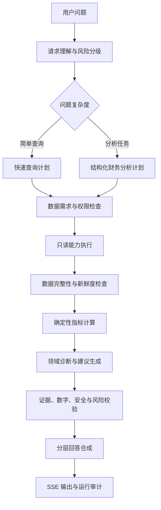

# Aurum Agent 财务领域化升级技术方案

> 文档状态：分阶段实施中（P7.1 已完成，2026-08-24 已移除知识库基线）  
> 形成日期：2026-08-16  
> 适用基线：财务领域计划、长期记忆和只读财务工具已经投入使用  
> 相关文档：[长期记忆开发计划](./aurum-agent-memory-development-plan-2026-08-13.md)、[生产发布与回滚手册](../deploy/release-runbook.md)

> 架构决策（2026-08-24）：产品不再提供个人知识库、文档上传、摄取、索引、检索、重排或
> 文档引用能力。通用财务知识由模型回答；个性化背景来自长期记忆；实时个人财务事实只能来自
> 当前用户作用域内的只读财务工具。旧阶段文档中的知识库/RAG 内容仅为历史记录。

## 1. 文档目标

本文档定义 Aurum Agent 下一阶段的领域化升级方案。升级目标不是建设面向本地编程的通用自治
Agent，也不是复刻 Claude Code，而是将现有“模型选择工具并生成回答”的能力，演进为面向个人
财务开支管理和个人投资理财的可规划、可计算、可验证、可解释的决策支持系统。

目标架构遵循以下定位：

> 以当前用户的实时财务事实为依据，以服务端确定性计算为核心，由大模型负责语义理解、有限规划、
> 结论解释和自然语言组织。

本文档用于统一后续的数据契约、LangGraph 编排、财务指标、回答协议、前端进度、测试评测和生产
发布门禁。除明确标注已完成的阶段外，文中新增组件仍为目标设计，不代表当前版本已经实现。

## 2. 设计决策与边界

### 2.1 不以 Coding Agent 为主要参照

Coding Agent 的核心对象是本地文件、代码仓库、Shell、测试进程和长时间探索任务；Aurum 的核心
对象是账户、流水、预算、持仓、行情、个人目标和受监管风险信息。两者在数据时效性、安全边界、
正确性来源和用户期望上均不同。

Aurum 只借鉴少量通用运行机制：

| 通用机制 | Aurum 中的使用方式 |
| --- | --- |
| 规划与执行分离 | 先生成受约束的财务分析计划，再查询数据和计算指标 |
| 工具调用闭环 | 模型只能调用服务端注册、按当前用户授权的只读能力 |
| Checkpoint | 保存图运行状态，用于恢复、审计和故障诊断 |
| 生命周期校验 | 在查询前、计算后、回答前执行确定性检查 |
| 上下文预算 | 分离会话、长期记忆和财务事实，并限制各层长度 |

首个版本不建设通用多 Agent 协商、任意 Shell、文件编辑、开放式插件市场和无限自主探索。领域能力
优先实现为普通服务和明确的 Graph 节点；只有某个领域确实需要独立上下文、多轮工具探索和独立
评测时，才考虑升级为受控子 Agent。

### 2.2 产品边界

本专项覆盖：

- 账户、收支、预算和异常交易分析；
- 净资产、现金流、储蓄率和应急资金等财务健康分析；
- 持仓、资产配置和集中度等投资组合分析；
- 结合用户目标、偏好和风险约束的解释与建议；
- 通用财务与投资知识问答，以及基于长期记忆的个性化解释；
- 多阶段分析进度、证据、审计和回归评测。

本专项暂不覆盖：

- 自动转账、下单、调仓或修改预算等写操作；
- 承诺收益、替代持牌人员的个性化证券交易指令；
- 税务、法律结论或缺少数据依据的信用判断；
- 任意第三方插件、脚本或数据库访问；
- 向用户暴露模型隐藏思维链。

## 3. 当前基线与主要差距

### 3.1 当前链路

当前核心 LangGraph 近似为：

```text
START
  ↓
run_capability_agent
  ↓
validate_answer
  ↓
END
```

`run_capability_agent` 由模型在有界轮次内选择长期记忆或只读财务能力；完成后统一执行
投资风险、财务事实、输出安全和协议校验。该结构已经具备可靠的工具隔离和回答守门能力，是本次
升级的基础，不需要推倒重建。

### 3.2 当前优势

- 财务和长期记忆均通过当前用户作用域内的受控能力访问；
- 模型不能执行任意 SQL，也不能自行指定用户 ID；
- 财务结果、回答协议、风险策略和输出安全已有确定性校验；
- PostgreSQL Checkpoint、SSE、运行审计和配额结算已经形成基础闭环；
- RLS 与 Repository 显式所有者条件共同保障多用户隔离；
- 发布流程已经记录 Graph、Prompt、评测集和配置版本，并定义模型及财务事实相关停止条件。

### 3.3 主要差距

1. `AgentQuestionPlan` 是对实际调用结果的归纳，不是执行前的任务计划。
2. Graph 没有显式的数据准备、指标计算、证据核验和回答合成阶段。
3. 当前提示词要求默认简洁，复杂问题的答案丰富度主要依赖模型临场发挥。
4. 工具返回事实，但尚未形成统一的指标计算层、数据新鲜度和完整性报告。
5. 阶段事件粒度较粗，不能准确反映复杂财务分析正在执行的工作。
6. 现有评测侧重路由、工具选择和安全，尚未系统衡量计划完整性、指标准确性、结论覆盖率、
   缺失数据披露和行动建议质量。

## 4. 目标架构

### 4.1 总体链路



### 4.2 组件职责

| 组件 | 主要职责 | 是否调用大模型 |
| --- | --- | --- |
| Request Classifier | 识别分析类型、时间范围、复杂度和风险等级 | 可调用一次低温度模型 |
| Financial Planner | 生成受 Schema 限制的数据、计算和输出计划 | 是 |
| Requirement Checker | 检查工具可用性、参数、权限和数据依赖 | 否 |
| Capability Executor | 查询账户、流水、预算、持仓、行情、知识和记忆 | 否，执行模型提出的受控调用 |
| Data Quality Checker | 检查缺失、过期、币种、同步状态和统计口径 | 否 |
| Metric Engine | 计算金额、比例、趋势、集中度和覆盖月数 | 否 |
| Domain Analyzer | 将事实和指标组织成发现、风险与行动候选项 | 是 |
| Evidence Verifier | 校验数字可追溯性、引用、风险和禁止内容 | 否为主，必要时受控修复 |
| Answer Composer | 按回答深度和协议生成最终自然语言 | 是 |

### 4.3 单协调器优先

首版采用一个 Orchestrator，由它选择确定性工作流和受控能力。收支、预算、财务健康和投资分析器
先实现为领域服务或 Graph 节点，而不是彼此自由对话的独立 Agent。

满足以下全部条件后，才考虑把某一领域提升为子 Agent：

- 单次分析确实需要多轮独立探索；
- 可以定义独立输入、输出、权限和 Token 预算；
- 能够单独建立质量评测集；
- 独立运行带来的质量收益显著高于延迟和复杂度成本；
- 汇总层仍能确定性验证其关键财务数字。

## 5. 财务任务分类

目标版本建议支持以下一级任务：

| `analysis_type` | 典型问题 | 默认路径 |
| --- | --- | --- |
| `transaction_lookup` | “最近一笔消费是什么？” | 快速查询 |
| `cashflow_review` | “分析我这个月的收支” | 收支汇总、分类、趋势 |
| `budget_review` | “哪些预算快超支了？” | 预算状态、消费映射、偏差 |
| `financial_health` | “全面分析我的财务状况” | 账户、现金流、预算、目标综合分析 |
| `portfolio_review` | “我的持仓是否过于集中？” | 持仓、行情、配置、集中度 |
| `goal_progress` | “我离应急金目标还有多远？” | 目标记忆、账户事实、进度计算 |
| `investment_education` | “什么是债券久期？” | 通用知识与风险边界 |
| `mixed` | “结合我的目标和持仓分析风险” | 财务事实与长期记忆组合 |

每一种任务必须定义必需数据、可选数据、确定性计算、风险规则和标准输出章节，避免只通过扩大提示词
来获得更长回答。

## 6. 核心数据契约

### 6.1 分析计划

建议新增不可变的 `FinancialAnalysisPlan`，示意如下：

```python
class FinancialAnalysisPlan(BaseModel):
    analysis_type: Literal[
        "transaction_lookup",
        "cashflow_review",
        "budget_review",
        "financial_health",
        "portfolio_review",
        "goal_progress",
        "investment_education",
        "mixed",
    ]
    response_depth: Literal["brief", "standard", "deep"]
    periods: tuple[AnalysisPeriod, ...]
    required_data: tuple[FinancialDataRequirement, ...]
    optional_data: tuple[FinancialDataRequirement, ...] = ()
    calculations: tuple[FinancialMetricName, ...] = ()
    output_sections: tuple[FinancialOutputSection, ...]
    risk_level: Literal["low", "medium", "high"]
    assumptions: tuple[str, ...] = ()
```

计划只描述允许的任务、数据和计算枚举，不接收 SQL、内部 UUID、任意工具名或可执行代码。服务端
需要再次将计划映射为能力调用，模型输出计划不等于获得执行权限。

### 6.2 数据质量报告

```python
class FinancialDataQualityReport(BaseModel):
    completeness: Literal["complete", "partial", "insufficient"]
    missing_requirements: tuple[str, ...] = ()
    stale_sources: tuple[str, ...] = ()
    currency_warnings: tuple[str, ...] = ()
    sync_warnings: tuple[str, ...] = ()
    assumptions: tuple[str, ...] = ()
```

数据不足时不应继续生成确定性结论。`partial` 可以生成有限分析，但必须在结论附近说明限制；
`insufficient` 应返回缺少的数据和下一步操作，不得由模型补全。

### 6.3 指标与发现

```python
class FinancialMetricValue(BaseModel):
    name: str
    value: Decimal
    unit: str
    period: AnalysisPeriod | None
    evidence_ids: tuple[str, ...]
    calculation_version: str


class FinancialFinding(BaseModel):
    category: str
    severity: Literal["info", "attention", "high"]
    title: str
    explanation: str
    evidence_ids: tuple[str, ...]
    metric_names: tuple[str, ...] = ()
```

所有关键数值必须关联工具证据或确定性计算结果。模型可以解释指标，但不能创建不存在的指标值。

### 6.4 最终回答协议

复杂回答建议先生成内部结构化对象，再渲染为 Markdown：

```python
class FinancialAnswerDraft(BaseModel):
    summary: str
    scope: str
    key_metrics: tuple[str, ...]
    findings: tuple[str, ...]
    risks: tuple[str, ...]
    actions: tuple[str, ...]
    limitations: tuple[str, ...]
    risk_notice: str | None = None
```

结构化对象只用于服务端校验与渲染，不要求前端直接展示 JSON。

## 7. LangGraph 目标节点

建议将当前图逐步拆分为：

```text
START
  ↓
classify_request
  ↓
build_financial_plan
  ↓
validate_plan
  ↓
execute_capabilities
  ↓
assess_data_quality
  ↓
calculate_metrics
  ↓
analyze_findings
  ↓
verify_answer
  ↓
compose_answer
  ↓
END
```

### 7.1 条件分支

- 简单交易或余额查询跳过复杂指标和诊断节点；
- 通用财务知识问题跳过个人财务工具；
- 数据不足时从 `assess_data_quality` 进入受控澄清或限制说明；
- 高风险投资问题强制经过投资风险策略；
- 校验失败允许一次受控修复，第二次失败返回安全错误，不发送未经校验的模型原始文本。

### 7.2 有界执行预算

每次运行必须具有可配置上限：

- 模型决策轮数；
- 能力调用总数和单轮并发数；
- 总 Token；
- 上下文字符数；
- 总运行时间；
- 单个数据源超时；
- 校验修复次数。

复杂度提升不等于无限增加调用。Planner 应合并互补查询，并由执行器去重相同的能力参数。

## 8. 确定性财务指标层

### 8.1 首批指标

| 领域 | 指标示例 |
| --- | --- |
| 现金流 | 收入、支出、净现金流、储蓄率、固定与可变支出占比 |
| 预算 | 使用率、剩余额度、超支额、按剩余天数推算的消费速度 |
| 财务健康 | 流动资产、负债、净资产、应急资金覆盖月数 |
| 消费结构 | 类别占比、主要支出类别、环比变化、异常大额交易 |
| 投资组合 | 资产类别占比、单一标的集中度、行业或币种暴露、未实现盈亏 |
| 目标 | 当前进度、剩余金额、按当前节奏估算的达成时间 |

### 8.2 计算规则

- 金额统一使用 `Decimal`，不得用二进制浮点完成财务计算；
- 每项指标定义明确的时间范围、币种和分母为零处理；
- 跨币种结果记录汇率来源、报价时间和换算币种；
- 趋势比较必须确保两个周期口径一致；
- 持仓市值必须标记行情时间，缺失行情不能静默使用成本价替代；
- 指标实现携带 `calculation_version`，便于回归和历史审计；
- 模型只接收已经计算完成的值和解释字段，不负责重新算术。

指标实现建议位于独立的 `app/finance/analytics/`，避免把计算规则堆入 Agent Prompt、工具执行器或
API Schema。

## 9. 上下文与证据分层

回答上下文必须保持以下边界：

| 上下文类型 | 可信含义 | 典型用途 | 能否作为实时财务事实 |
| --- | --- | --- | --- |
| 会话历史 | 用户与助手最近的对话 | 指代、追问和格式偏好 | 否 |
| 长期记忆 | 用户主动保存的目标、偏好、约束 | 个性化背景 | 否 |
| 个人财务档案 | 用户维护的相对稳定资料 | 风险偏好、基准币种等 | 仅限其字段语义 |
| 财务工具结果 | 当前查询获得的账户、流水、预算、持仓和行情 | 当前财务结论 | 是 |
| 确定性指标 | 服务端依据财务工具结果计算 | 数值结论 | 是 |

证据优先级建议为：当前工具事实和确定性指标高于历史消息及记忆。若记忆中的旧金额与当前工具结果
不一致，应说明“此前保存的信息”和“当前查询结果”的差异，不得静默覆盖。

## 10. 回答深度与内容协议

新增统一的 `response_depth`：

| 深度 | 适用场景 | 目标内容 |
| --- | --- | --- |
| `brief` | 单一事实查询 | 直接结论和必要口径 |
| `standard` | 一般分析和建议 | 结论、关键依据、风险、建议 |
| `deep` | 全面分析、比较、诊断 | 指标、发现、风险、优先级行动和数据限制 |

用户出现“详细分析”“全面评估”“为什么”“如何改善”“比较并给建议”等明确表达时，默认选择
`deep`；简单事实问题即使允许较长回答，也不应人为扩写无关内容。

`deep` 回答采用稳定章节：

1. 核心结论；
2. 数据范围与口径；
3. 关键指标；
4. 主要发现；
5. 风险和异常；
6. 按优先级排列的行动建议；
7. 数据不足、假设和时效限制；
8. 必要的投资风险提示。

建议必须与发现存在映射关系。例如“降低非必要支出”需要指向已识别的类别、金额或预算偏差，不能
生成缺少证据的通用建议。投资建议使用情景、风险和权衡表达，不给出确定性买卖指令。

## 11. SSE 进度与前端展示

前端只展示任务状态和已经发生的外部动作，不展示隐藏思维链。建议事件包括：

```text
plan_created
data_query_started
data_query_completed
data_quality_assessed
metrics_calculated
analysis_completed
verification_completed
answer_ready
```

用户可见文案示例：

```text
正在确认分析范围
正在获取本月收支和预算数据
正在检查数据完整性与更新时间
正在计算现金流和储蓄率
正在识别异常与风险
正在核验分析结论
正在生成行动建议
```

每个事件至少携带稳定的 `event_type`、`stage`、`sequence` 和非敏感摘要。日志和指标不记录用户
正文、流水描述、记忆内容或模型完整响应。SSE 恢复必须沿用现有序列游标，并保证重复消费幂等。

## 12. 安全、风险和合规约束

### 12.1 不变安全边界

- 所有个人能力继续绑定认证用户，事务中设置租户上下文；
- Repository 继续显式按 `user_id` 或 `owner_user_id` 限定；
- RLS 继续作为第二道防线；
- 模型不得发起写操作、任意 SQL、任意 URL 请求或跨用户查询；
- 工具参数必须由 Pydantic Schema 校验并受枚举、范围和长度约束；
- 交易描述、会话历史和长期记忆均按不可信内容处理，不得成为系统指令。

### 12.2 投资分析边界

- 区分事实、计算、假设和预测；
- 明示行情时间、数据不足和波动风险；
- 不承诺收益，不生成保证性措辞；
- 不把风险承受能力仅从持仓或聊天内容中推断为确定事实；
- 高风险问题必须经过专用策略校验；
- 若未来增加写操作，必须单独设计确认、授权、幂等、撤销和审计方案，不纳入本专项。

## 13. Provider 中立性

项目继续使用第三方模型 API，但领域编排不得绑定某个厂商的专有 Agent SDK。Provider 层应声明
并检测以下能力：

- 普通文本补全；
- Tool Calling；
- JSON Schema 或等价结构化输出；
- 流式输出；
- 上下文窗口与输出 Token 上限；
- 请求标识、用量和错误类型；
- 可选的并行 Tool Call。

Planner、Analyzer 和 Composer 通过项目内部接口调用 Provider。模型不支持严格结构化输出时，可以
使用 Pydantic 校验和一次修复；持续不合格则安全失败，不能将未验证 JSON 直接转换为工具调用。

## 14. 代码改造范围

建议的主要代码落点如下：

| 位置 | 改造内容 |
| --- | --- |
| `app/agents/contracts.py` | 新增分析计划、数据质量、指标、发现和回答草稿契约 |
| `app/agents/state.py` | 扩展 Graph 状态和阶段事件类型 |
| `app/agents/graph.py` | 拆分规划、执行、计算、分析、验证和合成节点 |
| `app/agents/capability_agent.py` | 收敛为 Planner/Analyzer 使用的受控模型循环，移除单一“默认简洁”策略 |
| `app/agents/capabilities.py` | 将计划数据需求映射为能力定义，补充领域元数据 |
| `app/agents/tools/finance.py` | 统一工具证据、数据时间和同步状态，不承载复杂分析逻辑 |
| `app/finance/analytics/` | 新增纯函数形式的确定性财务指标和诊断规则 |
| `app/services/answering.py` | 传递回答深度、事件和 Checkpoint 配置 |
| `app/services/chat.py` | 持久化计划摘要、指标证据和运行元数据 |
| `app/services/chat_runs.py` | 扩展可恢复的阶段事件协议 |
| `app/chat/providers/` | 完善 Provider 能力声明和结构化输出适配 |
| `web/src/views/ChatView.vue` | 展示真实阶段、分析范围和安全后的最终回答 |
| `evals/`、`scripts/` | 增加领域分析数据集、评分器和发布证据 |

数据库如需新增表，优先考虑：

- `chat.agent_run_plans`：保存结构化计划摘要和版本，不保存隐藏推理；
- `chat.agent_run_metrics`：保存关键指标名、值、单位、计算版本和证据引用；
- `chat.agent_run_events`：仅在需要跨进程耐久恢复时引入持久化事件流。

是否增加表应以审计、恢复和评测的实际需求为依据。首版可先复用 `AgentRun.metadata` 验证契约，避免
在设计未稳定前过早固化数据库结构。

## 15. 分阶段实施计划

### P7.1：计划与回答协议

> 状态：已完成（2026-08-16）。实现和验证结果见
> [P7.1 计划与回答协议验收报告](./aurum-agent-phase-7-p7.1-acceptance.md)。

- 新增 `response_depth` 和自动深度判断；
- 新增 `FinancialAnalysisPlan` 及服务端校验；
- 定义复杂回答章节和内部结构化草稿；
- 保持原工具和校验链路兼容；
- 为简单查询建立快捷路径。

验收重点：计划可审计、复杂回答结构稳定、简单问题无明显延迟回退。

### P7.2：确定性指标与数据质量

- 建立 `app/finance/analytics/`；
- 实现现金流、储蓄率、预算使用率、消费结构和集中度首批指标；
- 为工具结果补充查询时间、同步状态、币种和证据标识；
- 实现 `complete/partial/insufficient` 数据质量判断。

验收重点：财务算术由服务端完成，数据缺失不会被模型静默补全。

### P7.3：Graph 分阶段编排与前端进度

- 拆分目标 Graph 节点和条件边；
- 增加真实 SSE 阶段事件；
- 建立调用预算、超时、去重和降级策略；
- 在 Checkpoint 和 AgentRun 中记录计划及阶段摘要。

验收重点：前端阶段与真实运行一致，断线恢复和取消语义保持正确。

### P7.4：领域工作流

- 上线月度收支、预算偏差、财务健康和投资集中度工作流；
- 加入目标与长期记忆，但实时数值仍重新查询财务工具；
- 建立发现到建议的证据映射；
- 对高风险投资问题启用更严格的回答协议。

验收重点：典型问题能够生成完整、可解释且不越界的深度分析。

### P7.5：评测、灰度与优化

- 建立离线领域评测和真实 Provider 冒烟；
- 对比升级前后的质量、延迟和成本；
- 按用户稳定分桶灰度；
- 达到门禁后逐步扩大比例，并保留旧图快速回退能力。

验收重点：质量提升有量化证据，生产指标没有突破停止条件。

## 16. 测试与评测体系

### 16.1 确定性测试

- 指标公式、舍入、零分母和跨币种测试；
- 时间范围、时区和跨 UTC 日期边界测试；
- 计划 Schema、枚举和非法参数拒绝测试；
- 数据缺失、行情过期和账户未同步测试；
- 当前用户隔离、RLS 和越权调用测试；
- SSE 事件顺序、恢复、取消和幂等测试。

### 16.2 Agent 评测

新增或扩展以下指标：

| 指标 | 目标含义 |
| --- | --- |
| Plan completeness | 计划是否覆盖回答所需的数据和计算 |
| Tool precision/recall | 是否查询了必要能力且没有明显无关调用 |
| Numeric accuracy | 最终回答数字是否与工具和指标完全一致 |
| Evidence coverage | 关键结论是否关联有效证据 |
| Data limitation disclosure | 缺失、过期和假设是否明确披露 |
| Finding coverage | 是否发现测试样例中预设的主要问题 |
| Action grounding | 建议是否能追溯到发现和证据 |
| Risk compliance | 是否避免承诺收益和确定性交易指令 |
| Response depth fit | 回答深度是否匹配用户请求复杂度 |
| Cross-user isolation | 是否存在跨用户数据或记忆泄漏 |

评测集应同时包含正常问题、信息不足、冲突数据、提示注入、跨币种、相对日期、极端值和 Provider
异常。不能只使用“回答看起来更长”作为升级成功标准。

## 17. 可观测性与生产门禁

建议新增不包含用户正文的指标：

- 各 `analysis_type` 请求量和成功率；
- 各 `response_depth` 的延迟、Token 和能力调用数；
- Planner Schema 首次通过率和修复率；
- 数据完整、部分和不足的比例；
- 指标计算失败次数；
- 财务 Grounding、引用、风险和输出安全校验失败率；
- 各 Graph 节点 P50/P95；
- 快速路径与完整分析路径的命中率；
- 用户主动停止和 SSE 恢复次数。

发布 Manifest 继续记录 Graph、Prompt、模型、评测集、配置和计算版本。发布流程沿用现有蓝绿和
回滚策略，并补充以下候选证据：

- 新旧 Graph 版本及路由比例；
- 财务指标计算版本；
- 领域评测结果；
- 真实 Provider 结构化输出冒烟；
- 深度分析的 P95、平均 Token 和平均工具调用数；
- 跨用户、旧财务事实覆盖实时结果和缺失数据编造的零容忍结果。

如果升级导致现有运行手册中的错误率、P95、模型错误、队列或数据库阈值越界，应停止扩大灰度；
若出现跨用户泄漏、错误财务数字或未经证据支持的投资结论，应立即将新图流量降为零并回退。

## 18. 风险与应对

| 风险 | 应对方式 |
| --- | --- |
| 规划增加模型成本 | 简单查询走快速路径，缓存稳定计划模板，限制 Planner Token |
| 复杂图增加延迟 | 并发执行互补只读查询，设置节点超时和总预算 |
| 回答变长但价值不高 | 以发现覆盖、证据和行动映射评测，不以字数评测 |
| 模型生成非法计划 | 严格 Schema、服务端映射和一次受控修复 |
| 财务数据不同步 | 工具返回同步状态，数据质量节点明确降级 |
| 多来源口径冲突 | 统一时间、币种和优先级，冲突时显式披露 |
| 投资建议越界 | 风险分级、禁止措辞检查和高风险专用协议 |
| 数据库契约过早固化 | 先使用运行 metadata 验证，再决定是否建表 |

## 19. 最终验收标准

专项完成至少满足：

1. 简单事实问题仍能快速、准确回答，不被强制走完整分析流程；
2. 复杂问题在执行前形成可验证的结构化财务计划；
3. 关键财务数字全部来自实时工具或版本化的确定性计算；
4. 深度回答稳定包含结论、口径、指标、发现、风险、行动和限制；
5. 用户看到的阶段来自真实 Graph 节点，不是模拟思考动画；
6. 数据缺失、过期、冲突或不同币种时能够正确披露或拒绝推断；
7. 不输出隐藏思维链，不暴露工具内部结构或敏感运行信息；
8. 现有引用、安全、RLS、Checkpoint、取消、恢复和发布回滚能力不回退；
9. 领域评测证明答案质量提升，延迟和成本仍处于发布门禁范围；
10. 新架构保持 Provider 中立，不依赖 Claude Code 或任一模型厂商的专用 Agent 运行时。

## 20. 推荐落地结论

Aurum 下一阶段不应追求“更通用、更自治”，而应优先追求“财务事实更完整、计算更准确、风险更
明确、建议更可执行、过程更可审计”。推荐先完成 P7.1 和 P7.2，在不引入多 Agent 的前提下验证
结构化计划、确定性指标和深度回答的实际质量收益，再进入 Graph 拆分、领域工作流和生产灰度。
